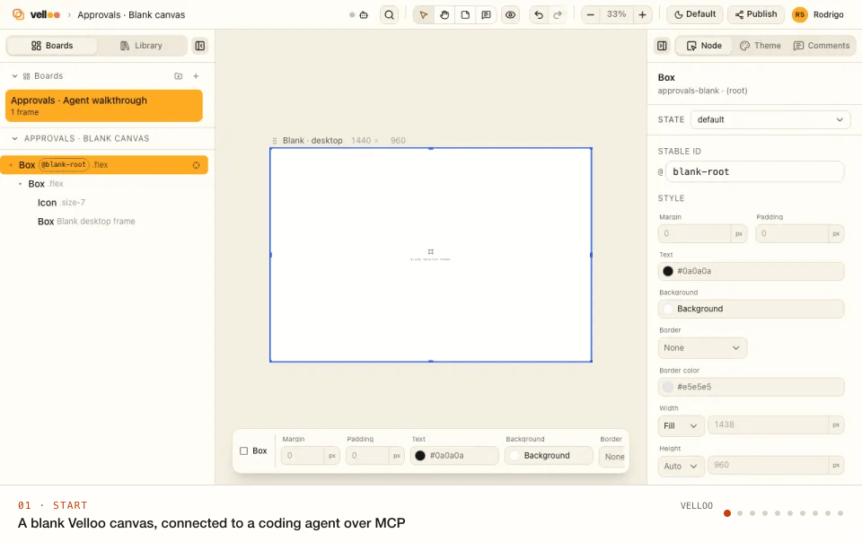

<div align="center">

<h1>
  <picture>
    <source media="(prefers-color-scheme: dark)" srcset="./.github/assets/velloo-lockup-dark.png">
    
  </picture>
</h1>

**Design like a developer. Build like a designer.**

Velloo is an open-source, local-first canvas for agent-driven design. It gives
your coding agent a structured understanding of your app — its routes,
components, theme, and conventions — so it can compose real screens, inspect the
rendered result, and write the chosen design back into your app while you keep
the taste and direction.

[](https://www.apache.org/licenses/LICENSE-2.0)
[](https://www.npmjs.com/package/velloo)
[](https://github.com/velloo-design/velloo/actions/workflows/ci.yml)
[](https://github.com/velloo-design/velloo/discussions)

[Quickstart](#quickstart) · [Documentation](./docs) · [Contributing](./CONTRIBUTING.md) · [Discussions](https://github.com/velloo-design/velloo/discussions) · [velloo.design](https://velloo.design)

</div>

<p align="center">
  <picture>
    <source media="(prefers-color-scheme: dark)" srcset="./.github/assets/walkthrough-dark.gif">
    
  </picture>
</p>

---

## What is Velloo?

Velloo adds a visual design loop to your coding agent. The agent works with your
actual component system, explores and verifies directions on the canvas, and
implements the direction you choose using your application's conventions.

Designs are readable JSON that can live in your repo or outside it. The complete
solo workflow is local and account-free; Velloo Cloud is optional when you want
published boards, review links, and comments that return to the canvas.

**No Figma seats. No paste-ready JSX you babysit. No translation tax.**

> **Status:** early and moving fast. The design-folder format is versioned and
> migrated by `velloo upgrade`, but expect rough edges and breaking changes
> before 1.0. Bug reports and design feedback are very welcome.

## Quickstart

Install the CLI. The npm package pulls an exact official Bun platform binary
with no install scripts — you don't install or manage Bun yourself:

```bash
npm install -g velloo          # or: pnpm add -g velloo
```

Prefer a standalone install (macOS and Linux)?

```bash
curl -fsSL https://get.velloo.design/install.sh | bash
```

Then, from inside your app:

```bash
cd ~/code/my-shadcn-app
velloo init                    # interactive wizard
velloo run velloo              # the design folder it just created
```

- **Canvas** → http://localhost:7300 (the next free port if that one is busy)
- **MCP server** → your agent starts `velloo mcp` over stdio; `init` already
  wrote that into its config. HTTP-only clients can run `velloo mcp --http`,
  which prints the URL to use.

Restart your agent so it picks up the new MCP config, then point it at a real
screen:

> "Use `velloo` to recreate the design for the billing page,
> then show me three takes on the plan-comparison section."

That's the loop. The agent builds on the canvas, screenshots its own work, and
you react to pixels instead of to a diff.

### What `init` does

The wizard creates a design folder (default `velloo/`), detects your routes,
component library, and theme, and connects supported coding agents through their
native MCP configuration and guidance format. It never changes your app source;
it only creates the design folder and agent configuration.

### Ways to use Velloo

- **Redesign an existing screen.** Recreate a route as a faithful baseline,
  explore alternatives beside it, and compare the result with the running app.
- **Start from scratch.** Choose your component library, then begin with the
  sample board or a blank canvas for a new screen or product idea.
- **Work from a live page.** Capture a public or authenticated page when the
  useful starting point is a browser rather than a route in the current app.

For better results, give the agent a concrete outcome and review bar: name the
screen, ask for genuinely different directions, say which components or tokens
must be preserved, and ask to see the canvas before application code changes.

### Velloo Cloud and `velloo publish`

Velloo Cloud is the optional collaboration layer; the local design remains the
source of truth. When you want feedback from someone else, sign in and publish a
board from the canvas or the CLI:

```bash
velloo login
velloo publish velloo
```

Choose the boards, destination, and access level when prompted. Velloo uploads
the material needed to render the review and prints a share link; comments on
that link sync back to the local canvas for you or your agent to resolve. A later
publish can update the same link and preserve its review context.

Use `velloo publish list` to see existing publications and
`velloo publish remove <share-url>` to take one down. Velloo Cloud is not
required to design, export, or implement a screen.

## Features

- **Existing-screen redesign.** Start from a React route or a captured
  authenticated page, recreate a faithful baseline, explore alternatives, and
  compare against the running product at the same viewport.
- **Real components, not approximations.** Components come from a
  `ComponentProvider`, so the design folder stays pure data. For shadcn,
  client-safe files from your app mount directly in the canvas; portal- and
  state-heavy families are explicitly adapted; compile failures fall back per
  component with diagnostics.
- **Five React adapters.** shadcn + Tailwind, Material UI, Ant Design, Chakra
  UI, and no-library React each render and emit through their own adapter.
- **Visual verification.** The agent inspects rendered nodes, takes screenshots,
  diffs against a live URL, and fixes what it sees instead of guessing from code.
- **Board → Screen → Frame.** One design folder holds many boards; frames that
  share a screen stay in sync, so a mobile and a desktop frame are one edit.
- **A real MCP surface.** Discovery, focused tree mutations, themes, screenshots,
  comparison, comments, and agent-consumed implementation IR — plus bundled
  skills for brand, design systems, logos, and design-to-code.
- **Optional collaboration.** Create a team, publish a board, share externally,
  and pull review comments back into the local canvas.

## Requirements

| | |
|---|---|
| **OS** | macOS (arm64, x64) and Linux (arm64, x64; glibc and musl). Windows via WSL. |
| **Your app** | React. shadcn + Tailwind, MUI, Ant Design, Chakra, and no-library folders are supported. |
| **Screenshots** | Optional headless Chromium, one command away (below). |

### Screenshots — the one optional extra

A headless Chromium is used for exactly two things: your agent's `screenshot`
tool (so it can *see* a design) and `velloo render <screen> --to=out.png`. The
canvas, editing, `publish`, `emit`, and everything else work without it. Install
it anytime (one-time, ~150 MB):

```bash
velloo browser install
```

If a screenshot ever fails, run exactly that command and retry.

## CLI essentials

A **design** is a folder with a `.design/config.json`, which holds its name. A
repo-root **`velloo.json`** lists where the repo's designs are (several can
coexist in a monorepo). Every design-taking command accepts a design name or a
path, and resolves through `velloo.json` when you pass nothing. With several
designs, a connected agent is told which one it is on and can switch between them.
Commands that take something else as their argument, like `emit <screen>`, take
the design as `--design`.

| Command | What it does |
|---|---|
| `velloo init` | Create a design folder and wire up your agent |
| `velloo run [design]` | Start the canvas + MCP daemon (`--port` to pick the canvas port) |
| `velloo design list\|add\|remove\|move\|rename\|upgrade` | Manage the repo's designs |
| `velloo emit` / `velloo render` | Implementation IR for your agent / a PNG of a screen |
| `velloo publish [design]` | Publish a board for review (`publish list\|remove` manage what you've published) |
| `velloo upgrade` | Update the install *and* migrate the design format (`--check` to preview) |

`Ctrl-C` stops the server.

**Keeping designs out of the app repo** is a first-class option — pick "Default
out of repo" in the wizard, give a path outside the repo, or run
`velloo init --external --name web`. The design is recorded
only on your machine: nothing is written into the repo, the files live under
`~/.velloo/designs/` (or where you chose) outside version control, and agents are
wired through global configs. See
[Local designs outside the repository](./docs/external-local-design-folders.md).

**Choosing an MCP surface.** Velloo defaults to a compact progressive-disclosure
surface: the agent sees `call_velloo`, `run_velloo_plan`, and `operation_schema`
and pays for a native schema only when it needs one. Clients that do better with
conventional function schemas can use `velloo mcp --surface full`. Both surfaces
carry the whole operation catalogue. See [docs/mcp.md](./docs/mcp.md).

## Local-first by default

The local tool is free, complete, account-free, and telemetry-free.

The CLI makes exactly one anonymous request outside the solo loop: at most daily,
a detached check reads the public npm release version and caches it locally. It
sends no project or account data, and `VELLOO_DISABLE_UPDATE_CHECK=1` turns it
off. Everything else that touches the network is opt-in and gated behind an
explicit `velloo login`:

- `velloo login` / `velloo publish` — publish boards to a personal or team
  workspace and create external review links
- comment tools — read and resolve team and external-review feedback
- `generate_asset` — hosted image/SVG generation, metered against your credits
- `send_feedback` — agent-side product feedback, only when enabled in the folder
  config

You choose when — and whether — to use any of them.

## Documentation

| | |
|---|---|
| [docs/architecture.md](./docs/architecture.md) | Design-folder format, providers, renderer, codegen, canvas daemon |
| [docs/mcp.md](./docs/mcp.md) | The MCP tool surface agents talk to |
| [docs/providers.md](./docs/providers.md) | Adding a framework adapter |
| [docs/css-class-channel.md](./docs/css-class-channel.md) | How styling is routed per framework |
| [docs/external-local-design-folders.md](./docs/external-local-design-folders.md) | Local designs outside the repo: storage, agents, relocation, binding |

## Contributing

Contributions are welcome — bug reports, adapters, docs, and design feedback
alike. [`CONTRIBUTING.md`](./CONTRIBUTING.md) covers setup and the checks we
expect to be green; [`CLAUDE.md`](./CLAUDE.md) explains the repo's architecture
invariants before you change anything load-bearing.

The short version:

```bash
bun install                                 # also builds the snapshot manifest
bun run --cwd packages/canvas build         # build the canvas SPA
bun run velloo init /tmp/velloo-smoke
bun run velloo run /tmp/velloo-smoke        # canvas on :7300
bun run verify                              # typecheck + lint + knip + tests
```

Good first issues are labelled
[`good first issue`](https://github.com/velloo-design/velloo/labels/good%20first%20issue).

### Repo layout

Velloo is a Bun-workspaces monorepo with one-way dependencies:

| Package | Responsibility |
|---|---|
| `packages/schema` | Zod schemas + TS types for the on-disk design-folder format |
| `packages/protocol` | The wire contract: mutation arguments, typed errors, watch events |
| `packages/provider` | The `ComponentProvider` / `FrameworkAdapter` interface |
| `packages/provider-*` | shadcn, MUI, Ant Design, Chakra, and no-library adapters |
| `packages/shadcn-snapshot` | Pinned canvas-safe shadcn fallback, embedded in the binary |
| `packages/renderer` | Design JSON → HTML (and PNG via Playwright) |
| `packages/codegen` | Agent-consumed IR + theme emitters |
| `packages/server` | HTTP + MCP + mutations + theme + watcher |
| `packages/canvas` | Vite/React canvas UI |
| `packages/cli` | The `velloo` binary |

## Community and support

- **Questions, ideas, show-and-tell** →
  [Discussions](https://github.com/velloo-design/velloo/discussions)
- **Bugs and feature requests** →
  [open an issue](https://github.com/velloo-design/velloo/issues/new/choose)
- **Security issues** → [`SECURITY.md`](./SECURITY.md) — please don't file a
  public issue
- **Ground rules** → [`CODE_OF_CONDUCT.md`](./CODE_OF_CONDUCT.md)

## License

Velloo is open source under the [Apache License 2.0](./LICENSE).

The **Velloo** name and the interlinked-frames mark are trademarks and are not
covered by the code license — fork the code freely, but don't ship a derivative
under the Velloo name or logo. See [`TRADEMARK.md`](./TRADEMARK.md).
