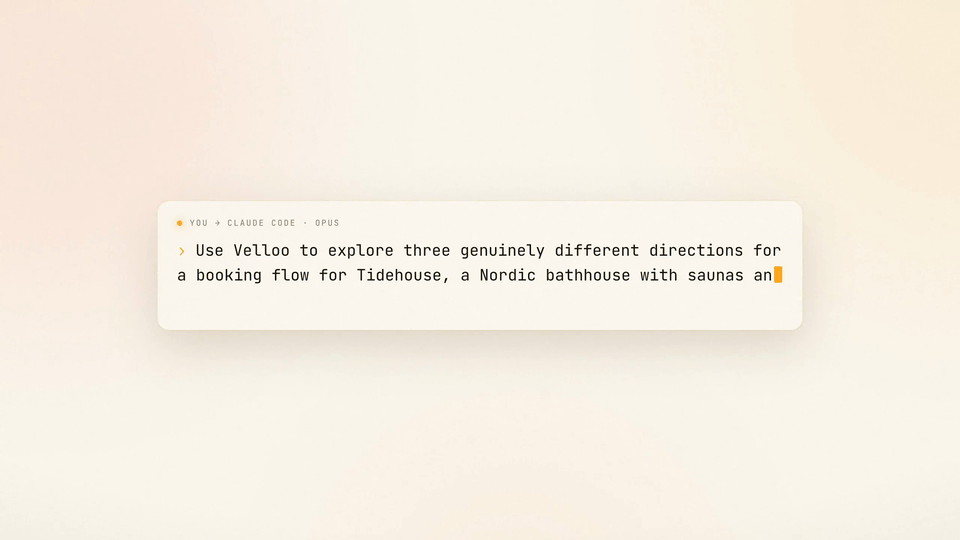

<div align="center">

<h1>
  <picture>
    <source media="(prefers-color-scheme: dark)" srcset="./.github/assets/velloo-lockup-dark.png">
    
  </picture>
</h1>

**Give your coding agent a place to design.**

Velloo is an open-source, local-first canvas for exploring design with your
coding agent. Try directions in real components, refine them yourself or with
feedback from others, then implement the one you believe in.

[](https://www.apache.org/licenses/LICENSE-2.0)
[](https://www.npmjs.com/package/velloo)
[](https://github.com/velloo-design/velloo/actions/workflows/ci.yml)
[](https://github.com/velloo-design/velloo/discussions)

[Quickstart](#quickstart) · [Watch the film](https://velloo.design/#walkthrough) · [Documentation](https://velloo.design/docs/) · [Contributing](./CONTRIBUTING.md) · [Discussions](https://github.com/velloo-design/velloo/discussions) · [velloo.design](https://velloo.design)

</div>

<p align="center">
  <a href="https://velloo.design/#walkthrough">
    <picture>
      <source media="(prefers-color-scheme: dark)" srcset="./.github/assets/walkthrough-dark.gif">
      
    </picture>
  </a>
</p>

<p align="center">
  <a href="https://velloo.design/#walkthrough"><b>▶ Watch the 79-second film, with sound</b></a>
  ·
  <a href="https://share.velloo.dev/s/db87dafb3d/">Open the board it published</a>
  <br>
  <sub>One real run, nothing mocked: Claude Code driving Velloo 0.6 from a blank folder to a running app.</sub>
</p>

---

## Quickstart

```bash
npm install -g velloo     # or: pnpm add -g velloo
cd your-app               # or an empty folder, to start something new
velloo init               # wizard: reads your routes, components and theme, connects your agent
velloo run                # starts the canvas on http://localhost:7300
```

Restart your agent so it picks up the MCP config `init` wrote, then ask:

> "Use Velloo to explore three genuinely different directions for the billing
> page. Put them side by side on one board, and show me the canvas before you
> change any application code."

The agent builds on the canvas and you react to pixels instead of to a diff.
For the agent to see its own work, install the optional headless browser once
with `velloo browser install`.

`init` only creates a design folder and agent configuration; it never changes
your app's source. The [quickstart guide](https://velloo.design/docs/quickstart/)
covers the standalone installer, the wizard's choices, and what to do next;
[Connect an agent](https://velloo.design/docs/agent/connect/) covers every
supported agent and manual MCP setup.

> **Status:** early and moving fast. The design-folder format is versioned and
> migrated by `velloo upgrade`, but expect rough edges and breaking changes
> before 1.0. Bug reports and design feedback are very welcome.

## Why Velloo

**Making things got cheap. Deciding what to make did not.**

Exploring alternatives and refining them with feedback is how good design has
always worked. What changed is where screens start: in a code editor, with an
agent, often before anyone has talked about the design. When the first working
interface arrives looking finished, that conversation is easy to skip.

Velloo brings it to the repository and the agent you already use, so it can
happen before the code lands.

## How it works

The loop the film shows:

1. **Explore.** One prompt, several directions, composed on the canvas from
   real components and checked by the agent against its own screenshots.
2. **Refine.** Pin comments on the one you like. The agent addresses them and
   replies in the thread, or you tune props and styles yourself.
3. **Publish and review** *(optional)*. Send a board to Velloo Cloud. Anyone
   with the link comments in a browser, and their notes return to your canvas.
4. **Ship.** The agent reads the chosen screen as framework-native output,
   writes real application code, and compares the running app to the design.

Under the canvas, each screen is a readable JSON tree of components, props, and
styles in a folder you own. You see the interface; your agent reads the same
structure, which is how it makes precise changes and carries a design into
code. [Concepts →](https://velloo.design/docs/concepts/)

## Ways to use Velloo

- **Start from scratch.** No app required. Pick a component library, then
  design a new product from the sample board or a blank canvas, as the film
  does. [Design a screen →](https://velloo.design/docs/guides/design-a-screen/)
- **Redesign an existing screen.** Recreate a route as a faithful baseline,
  explore alternatives beside it, and compare with the running app.
  [Port an existing page →](https://velloo.design/docs/guides/port-a-page/)
- **Work from a live page.** Capture a public or signed-in page with
  `velloo capture` when the starting point is a browser, not a route.
- **Act on feedback.** Hand the agent the open comments, local or from a
  published link. [Velloo Cloud →](https://velloo.design/docs/cloud/)
- **Implement the chosen design.** Turn a screen into code in your app's
  conventions. [From design to code →](https://velloo.design/docs/guides/emit/)

For the thinking behind this way of working, read
[Why I created Velloo](https://velloo.design/blog/why-i-created-velloo/).

## Works with your stack

| Your app | How it's styled and emitted |
|---|---|
| **shadcn/ui + Tailwind** | Your own component files, Tailwind `className` |
| **Material UI** | Real `@mui/material`, the `sx` prop |
| **Ant Design** | Real antd components, inline `style` |
| **Chakra UI** | Real Chakra v2 components, `sx` |
| **No-library React** | Plain HTML primitives, Tailwind or inline `style` |
| **HTML + htmx** | Your app's CSS, native markup with `hx-*` ([guide](https://velloo.design/docs/guides/html/)) |
| **Anything else your app renders** | Mantine, a private design system, your own `components/` ([how](https://velloo.design/docs/concepts/repository-components/)) |

It connects over MCP to Claude Code, Codex, Cursor, GitHub Copilot, Gemini CLI,
OpenCode, Windsurf, and other MCP clients, and runs on macOS, Linux, and
Windows. [Framework-native, in depth →](https://velloo.design/docs/concepts/frameworks/)

## Local-first, cloud optional

The local tool is free, complete, account-free, and telemetry-free. The only
request it makes on its own is an anonymous, at-most-daily check of the public
npm release version (`VELLOO_DISABLE_UPDATE_CHECK=1` turns it off).

[Velloo Cloud](https://velloo.design/docs/cloud/) is the opt-in half, behind an
explicit `velloo login`: published boards, review links, comments that return
to your canvas, and hosted asset generation. `velloo publish` uploads what your
machine rendered; the cloud never executes your app code. Reviewers need no
install, repo access, or paid seat. Plans are on the
[pricing page](https://velloo.design/pricing/).

## Documentation

**[velloo.design/docs](https://velloo.design/docs/)** has the guides, concepts,
and reference:
[CLI](https://velloo.design/docs/reference/cli/) ·
[MCP tools](https://velloo.design/docs/reference/mcp/) ·
[Design folder](https://velloo.design/docs/concepts/design-folder/) ·
[Themes](https://velloo.design/docs/guides/theme/) ·
[What's new](https://velloo.design/docs/whats-new/) ·
[FAQ](https://velloo.design/#faq)

For how Velloo itself is built, see [`docs/`](./docs): the
[architecture](./docs/architecture.md), the [MCP surface](./docs/mcp.md),
[writing a framework adapter](./docs/providers.md), and
[designs kept outside the repo](./docs/external-local-design-folders.md).

## Contributing

Contributions are welcome — bug reports, adapters, docs, and design feedback
alike. [`CONTRIBUTING.md`](./CONTRIBUTING.md) covers setup and the checks we
expect to be green; [`AGENTS.md`](./AGENTS.md) explains the package layout and
the architecture invariants before you change anything foundational.

```bash
bun install                                 # also builds the snapshot manifest
bun run --cwd packages/canvas build         # build the canvas SPA
bun run velloo init /tmp/velloo-smoke
bun run velloo run /tmp/velloo-smoke        # canvas on :7300
bun run verify                              # typecheck + lint + knip + tests
```

Good first issues are labelled
[`good first issue`](https://github.com/velloo-design/velloo/labels/good%20first%20issue).

## Community and support

- **Questions, ideas, show-and-tell** →
  [Discussions](https://github.com/velloo-design/velloo/discussions)
- **Bugs and feature requests** →
  [open an issue](https://github.com/velloo-design/velloo/issues/new/choose)
- **Security issues** → [`SECURITY.md`](./SECURITY.md) — please don't file a
  public issue
- **Ground rules** → [`CODE_OF_CONDUCT.md`](./CODE_OF_CONDUCT.md)

## License

Velloo is open source under the [Apache License 2.0](./LICENSE).

The **Velloo** name and the interlinked-frames mark are trademarks and are not
covered by the code license — fork the code freely, but don't ship a derivative
under the Velloo name or logo. See [`TRADEMARK.md`](./TRADEMARK.md).
